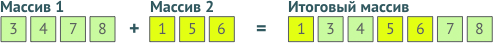

# СЛИЯНИЕ ОТСОРТИРОВАННЫХ МАССИВОВ

Сложность: 5 из 10

Иногда на практике нужно из двух отсортированных массивов собрать один:



Создайте функцию `merge`, которая будет принимать два отсортированных массива и возвращать один общий.

Массивы должны быть представлены обычными python-списками.

Каждый массив может содержать любое количество элементов, в том числе 0.

Значения элементов в массивах могут повторяться.

**Пример использования**:

```python
array1 = [3, 4, 7, 8]
array2 = [1, 5, 9]
array = merge(array1, array2)
print(array)
[1, 3, 4, 5, 7, 8, 9]
```

Используйте [файл с заглушкой для функции merge](initial.py) как основу для вашего кода.

**[Решение](merge_arrays.py)**.